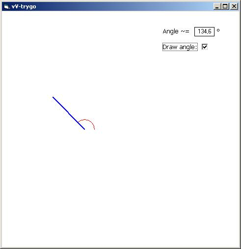



## vV\-trygo

### Description

Easy to use module which helps with trigonometry. You can easily calculate angle between two points by using simple and easy to use function.
 
### More Info
 

             |
---                |---
**Submitted On**   |2008-11-12 11:43:30
**By**             |[vViktor](https://github.com/Planet-Source-Code/PSCIndex/blob/master/ByAuthor/vviktor.md)
**Level**          |Intermediate
**User Rating**    |5.0 (10 globes from 2 users)
**Compatibility**  |VB 5\.0, VB 6\.0
**Category**       |[Math/ Dates](https://github.com/Planet-Source-Code/PSCIndex/blob/master/ByCategory/math-dates__1-37.md)
**World**          |[Visual Basic](https://github.com/Planet-Source-Code/PSCIndex/blob/master/ByWorld/visual-basic.md)
**Archive File**   |[vV\-trygo21338411122008\.zip](https://github.com/Planet-Source-Code/vviktor-vv-trygo__1-71385/archive/master.zip)

